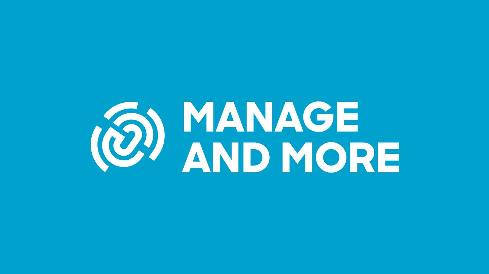

# Manage and More Design System

The single source for the **Manage and More** brand (an endorsed brand of UnternehmerTUM): guidelines, design tokens, logo files, labels, fonts, icons, illustrations and photo references. Built for **people** and especially for **AI coding agents**.



## Start here

| You are… | Go to |
|---|---|
| A designer or marketer | [`guidelines/`](guidelines/README.md), or open [`index.html`](index.html) for the visual overview |
| A developer | [`tokens/`](tokens/README.md) (CSS, SCSS, JSON, Tailwind), [`examples/`](examples/landing-page.html), [`assets/`](assets/README.md) |
| An AI agent | [`AGENTS.md`](AGENTS.md) and the skill in [`skills/manage-and-more-brand/`](skills/manage-and-more-brand/SKILL.md) |
| Adding new brand knowledge | [`CONTRIBUTING.md`](CONTRIBUTING.md) |

## Brand in 30 seconds

- **Logo:** blue swirl symbol + "MANAGE / AND MORE" wordmark. Four versions: blue+black, blue+white, all black, all white. Never all-blue. → [assets/logo](assets/logo/svg/)
- **Colours:** Blue `#00A2CD` · Yellow `#FFED00` · Black `#000000` · White `#FFFFFF` · Grey `#E3E3E3` · greys `#575756` `#878787` `#B2B2B2`. Text on blue is black; blue text on white uses `#007D9E`.
- **Type:** Sharp Sans Medium 500 / Extrabold 800 (licensed; files in the website repo), Work Sans fallback (bundled). Big Extrabold headlines with the two-tone outline/solid heading, line-height 1.15 on screens (1.0 in print); body 15-20px Medium; left-aligned; no italic. Arial for e-mail and PowerPoint.
- **Look on screens (manageandmore.de):** full-bleed photo/video hero with a black shade, alternating black and white sections, blue for emphasis, arrow-link CTAs with a filled "sticker" circle, rounded photos and cards (0.75rem / 2rem), square colour blocks. Motion is short and reactive: stickers scale, links underline, images zoom and fade in. → [web components](guidelines/13-web-components.md), [motion](guidelines/14-motion.md)
- **Look in print:** flat, high-contrast colour blocks, monoline icons, line-art illustrations with a big blue circle or yellow ground, documentary photography.
- **Endorsement:** BY UNTERNEHMERTUM label in the hero corner and print corners; ENTREPRENEURIAL EDUCATION descriptor + label in the website footer.

## Repository map

```
AGENTS.md                 entry point for AI agents (CLAUDE.md points here)
index.html                visual brand overview (open in a browser / GitHub Pages)
guidelines/               the rules, one topic per file, with front matter
tokens/tokens.json        design tokens, single source of truth (W3C format)
tokens/build/             generated: tokens.css, tokens.scss, tokens.flat.json, tailwind.preset.js (v3), tailwind.theme.css (v4)
assets/catalog.json       machine-readable index of every asset
assets/logo/              logo + symbol, SVG and PNG
assets/labels/            BY UNTERNEHMERTUM label, descriptor lock-ups
assets/icons/             16 monoline icons (SVG currentColor + PNG)
assets/ui/                UI glyphs from the live website (arrows, chevron, check, plus/minus, close, menu, quote, LinkedIn)
assets/illustrations/     line-art illustrations (SVG + PNG)
assets/infographics/      chart style examples
assets/photography/       reference photos by topic + tint examples; website/ = M&M's own photos
assets/fonts/work-sans/   Work Sans (OFL), web + desktop
examples/                 base CSS + a reference landing page
skills/manage-and-more-brand/  agent skill (also linked in .claude/skills/)
source/                   canonical PDF, its full text and page images
scripts/                  build tokens, validate, re-extract from PDF, tint photos, install skill
```

## Use it in another project

```bash
# tokens + fonts
cp mm-design-system/tokens/build/tokens.css your-app/styles/            # or tailwind.theme.css for Tailwind v4
cp -r mm-design-system/assets/fonts/work-sans your-app/public/fonts/    # fallback; Sharp Sans files come from the website repo
# Claude Code / agent skill, available in every project on this machine
./mm-design-system/scripts/install-skill.sh
```

## Commands

```bash
python3 scripts/build_tokens.py     # rebuild tokens/build/* after editing tokens/tokens.json
python3 scripts/validate.py         # check catalogue, tokens, links, SVGs (also runs in CI)
python3 scripts/tint_photo.py in.jpg out.jpg [--mode bw]   # brand blue tint / B&W
python3 scripts/extract/extract_pdf.py source/MM_CI.pdf    # re-extract assets (needs pymupdf, pillow)
```

## Status and sources

Two sources: the **2020 Manage and More brand guideline** (`source/MM_CI.pdf`), canonical for print and identity assets; and the **manageandmore.de codebase** (`manage-and-more-website` repo), adopted on 2026-10-07 as the standard for screens (type scale, layout, components), corrected for WCAG 2.2 AA. Differences, open website fixes and decisions: [guidelines/sources-and-discrepancies.md](guidelines/sources-and-discrepancies.md).

Sharp Sans is a commercial font licensed by Manage and More; it is not included here (copy it from the website repo). Work Sans is included under the SIL Open Font License. Logos, labels, illustrations and photos belong to Manage and More / UnternehmerTUM.
