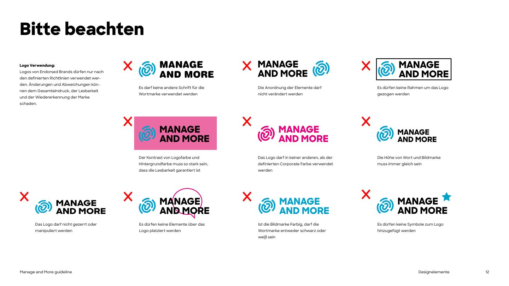

# Logo

The logo is a **symbol** (a circular, fingerprint-like swirl of arcs around a linked core) plus a **two-line wordmark** "MANAGE / AND MORE" set in Sharp Sans Extrabold capitals. The symbol and wordmark always appear together, at the same height, in this arrangement.


## Files

| Use on | File (SVG, preferred) | PNG (1200px wide) |
|---|---|---|
| White, light grey, yellow, light photos | [`mm-logo-primary.svg`](../assets/logo/svg/mm-logo-primary.svg) (blue symbol, black wordmark) | [png](../assets/logo/png/mm-logo-primary.png) |
| Black, dark photos | [`mm-logo-primary-on-dark.svg`](../assets/logo/svg/mm-logo-primary-on-dark.svg) (blue symbol, white wordmark) | [png](../assets/logo/png/mm-logo-primary-on-dark.png) |
| Brand blue, any colour where the blue symbol would vanish | [`mm-logo-white.svg`](../assets/logo/svg/mm-logo-white.svg) | [png](../assets/logo/png/mm-logo-white.png) |
| One-colour print, fax, embossing, light backgrounds | [`mm-logo-black.svg`](../assets/logo/svg/mm-logo-black.svg) | [png](../assets/logo/png/mm-logo-black.png) |
| Symbol only: favicon, app icon, avatar, very small sizes | [`mm-symbol-blue.svg`](../assets/logo/svg/mm-symbol-blue.svg), [`-black`](../assets/logo/svg/mm-symbol-black.svg), [`-white`](../assets/logo/svg/mm-symbol-white.svg) | [blue](../assets/logo/png/mm-symbol-blue.png) |

All files were extracted as vectors directly from the guideline PDF (p.11) and are exact. The symbol-only files are cut from the same artwork; the PDF does not show the symbol alone, but the live website uses it as favicon (see [sources-and-discrepancies.md](sources-and-discrepancies.md)).

## Colour versions (PDF p.10-11)

Exactly four versions exist. Pick the one with the strongest contrast to the background.

| Version | Symbol | Wordmark | Typical background |
|---|---|---|---|
| Primary | Blue `#00A2CD` | Black | White |
| Primary on dark | Blue `#00A2CD` | White | Black |
| Black | Black | Black | White / light |
| White | White | White | Blue, black, photos |

The PDF's hero example (p.10) is the **white logo on a full blue surface**.

## Construction (PDF p.9)

The unit **U** is the height of the symbol (the PDF derives it from the UnternehmerTUM "U").

- **Clear space:** at least **0.5 U** on all sides. Nothing (text, edges, other logos) enters this zone. In CSS: padding of at least half the rendered logo height.
- **Gap between symbol and wordmark:** **1/3 of the width of U**. Already built into the files; never re-space.
- **Wordmark:** one, two or three lines are possible for endorsed brands; Manage and More uses **two lines**, leading 100%, top and bottom aligned flush with the symbol. A one-line version uses the same font size and is vertically centred on the symbol. *(No one-line artwork exists in the PDF; do not create one without approval.)*
- **Distance to the edge of a layout:** at least 0.5 U.

## Minimum size *(derived, not in the PDF)*

- Full logo: 32px tall on screen, 10mm tall in print.
- Below that, use the symbol alone.

## Do not (PDF p.12)



1. Do not set the wordmark in any other typeface.
2. Do not rearrange the elements (e.g. symbol to the right).
3. Do not draw frames or boxes around the logo.
4. Do not place the logo on backgrounds with weak contrast (e.g. blue logo on pink).
5. Do not recolour the logo in any colour other than the defined corporate colour (blue), black or white.
6. Do not change the size ratio: symbol and wordmark are always the same height.
7. Do not stretch, squash, rotate the parts, or otherwise manipulate the logo.
8. Do not place elements (speech bubbles, stickers, text) over the logo.
9. **When the symbol is blue, the wordmark must be black or white. An all-blue logo is not allowed.**
10. Do not add symbols (stars, icons) to the logo.

Also derived from these rules: no drop shadows, glows, gradients or outlines on the logo.

## For code

```html
<!-- light background -->

<!-- dark background -->

```

The `alt` text is always "Manage and More". Keep the original aspect ratio (set only height or only width).

### On the website *(adopted)*

- The header shows the **primary logo on dark** (blue symbol, white wordmark) over the dark hero, **98px wide** on mobile and **128px** from 768px (about 37px and 48px tall, above the 32px minimum). Tokens `--mm-layout-header-logo-width-*`.
- The website inlines the SVG (`src/components/Logo.tsx`): the wordmark uses `currentColor` (white in the header) and the symbol the brand blue. This is fine as long as the artwork is the original and the wordmark is only ever black or white. Never let `currentColor` turn the wordmark blue.
- Favicon: the blue symbol (`src/app/icon.png`, 192px).
- The website's symbol blue is `#00A2CC`/`#04A2CC` instead of `#00A2CD`. The difference is invisible; new work uses `#00A2CD` and the files in `assets/logo/`.
