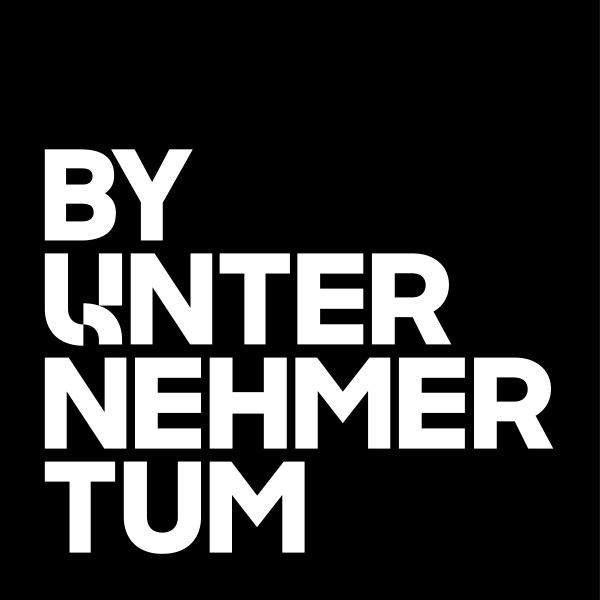
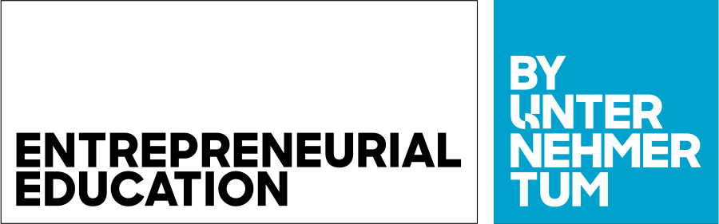

# Endorsement labels

Two square-box labels connect Manage and More to its umbrella brand UnternehmerTUM.

## 1. Logo Label: BY UNTERNEHMERTUM (PDF p.13)

- Shows that Manage and More belongs to UnternehmerTUM.
- It is a **square box**, which makes it easy to place on any layout, and it has **no clear-space zone**.
- Colours: **black, white, or the sub-brand corporate colour (Manage and More blue)**. **Never UnternehmerTUM blue.**
- The box can be **solid** or **outline**. On busy backgrounds (photos, patterns) use the **solid** label.

| File | Look | Use on |
|---|---|---|
| [`by-unternehmertum-label-black.svg`](../assets/labels/svg/by-unternehmertum-label-black.svg) | solid black box, white text | white, light, photos |
| [`by-unternehmertum-label-white.svg`](../assets/labels/svg/by-unternehmertum-label-white.svg) | solid white box, black text | black, blue, dark photos |
| [`by-unternehmertum-label-blue.svg`](../assets/labels/svg/by-unternehmertum-label-blue.svg) | solid M&M blue box, white text | white, black |
| [`by-unternehmertum-label-outline-black.svg`](../assets/labels/svg/by-unternehmertum-label-outline-black.svg) | black outline, black text, transparent | calm light backgrounds |
| [`by-unternehmertum-label-outline-white.svg`](../assets/labels/svg/by-unternehmertum-label-outline-white.svg) | white outline, white text, transparent | calm dark or blue backgrounds |

The white versions are colour-swapped from the PDF artwork (the PDF allows white but only shows black, outline and blue).

### Size and placement (PDF p.14)

- Placement: in **any of the four corners** of a format, **inside the type area** (portrait and landscape).
- Size: lay the label **8 times** along the **short side** of the format; one label = short side ÷ 8. Depending on the layout you can use 1x up to 10x; DIN formats use 8x.
- **Business cards: no label.**

| Format | Minimum label size |
|---|---|
| Business card | no label |
| DIN A6 | 13.1 mm |
| DIN A5 | 18.5 mm |
| DIN A4 | 26.2 mm |
| DIN A3 | 37.1 mm |
| DIN A2 | 52.5 mm |
| DIN A1 | 74.2 mm |
| DIN lang | 17.5 mm |
| 16:9 presentation | 24.1 mm |
| Roll-up | 121.4 mm |

Screens *(adopted from the website)*: the label sits in the **bottom-right corner of every hero**, 20px from the edges (50px from 768px), **40px square, 80px from 768px** (`--mm-label-size-web-mobile`, `-web-desktop`). This applies the PDF's "label in a corner" rule to the screen. Use [`by-unternehmertum-label-outline-white.svg`](../assets/labels/svg/by-unternehmertum-label-outline-white.svg) on calm images and the solid [`by-unternehmertum-label-white.svg`](../assets/labels/svg/by-unternehmertum-label-white.svg) on busy ones. Do not re-typeset the label in CSS. (The website currently does this in `src/components/UnternehmerTumBadge.tsx`; see [sources-and-discrepancies.md](sources-and-discrepancies.md#website-fixes).)

## 2. Descriptor Label: ENTREPRENEURIAL EDUCATION (PDF p.15)

- Places Manage and More within the UnternehmerTUM ecosystem (category: entrepreneurial education).
- **Never used alone**, always together with the Logo Label, and **always to the left** of it. (The Logo Label can be used alone.)
- The descriptor must **contrast in colour with the Logo Label** (if one is solid, the other is outline).
- Use it on the Manage and More website (footer) and in other media.

| File | Descriptor | Logo label |
|---|---|---|
| [`descriptor-lockup-outline-black.svg`](../assets/labels/svg/descriptor-lockup-outline-black.svg) | black outline | black outline |
| [`descriptor-lockup-outline-label-black.svg`](../assets/labels/svg/descriptor-lockup-outline-label-black.svg) | black outline | solid black |
| [`descriptor-lockup-solid-black.svg`](../assets/labels/svg/descriptor-lockup-solid-black.svg) | solid black | black outline |
| [`descriptor-lockup-label-blue.svg`](../assets/labels/svg/descriptor-lockup-label-blue.svg) | black outline | solid blue |
| [`descriptor-lockup-solid-blue.svg`](../assets/labels/svg/descriptor-lockup-solid-blue.svg) | solid blue | black outline |
| [`descriptor-lockup-outline-white.svg`](../assets/labels/svg/descriptor-lockup-outline-white.svg) | white outline | white outline (derived, for blue/black footers as on p.37) |

## Website use (PDF p.37)

Place the descriptor + logo label lock-up clearly visible in the **website footer**. The PDF example is a **blue footer** with white outline labels, footer links (Contact, LinkedIn, Press, Newsletter, Impressum, Datenschutz) above them. The website's footer is **black**; on a blue or black footer use [`descriptor-lockup-outline-white.svg`](../assets/labels/svg/descriptor-lockup-outline-white.svg), about 56-64px tall.

On the website the endorsement therefore appears twice: the logo label in the hero corner and the lock-up in the footer.

> The live site shows the hero label but not the footer lock-up yet; see [sources-and-discrepancies.md](sources-and-discrepancies.md#website-fixes).
