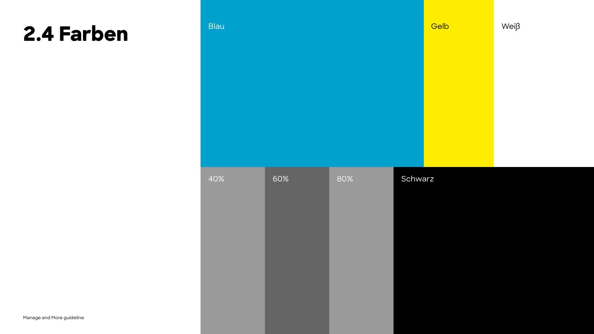

# Colour

## Palette

### Primary (PDF p.17)

| Name | HEX | RGB | CMYK | Token |
|---|---|---|---|---|
| **Blue** | `#00A2CD` | 0 162 205 | 76 16 12 0 | `--mm-color-brand-blue` |
| **Yellow** | `#FFED00` | 255 237 0 | 0 0 100 0 | `--mm-color-brand-yellow` |
| **Black** | `#000000` | 0 0 0 | 0 0 0 100 | `--mm-color-brand-black` |
| **White** | `#FFFFFF` | 255 255 255 | 0 0 0 0 | `--mm-color-brand-white` |
| **Grey** | `#E3E3E3` | 227 227 227 | 0 0 0 15 | `--mm-color-brand-grey` |

### Secondary (PDF p.17)

| Name | HEX | RGB | CMYK | Token |
|---|---|---|---|---|
| 80% Black | `#575756` | 87 87 87 | 0 0 0 80 | `--mm-color-neutral-black-80` |
| 60% Black | `#878787` | 135 135 135 | 0 0 0 60 | `--mm-color-neutral-black-60` |
| 40% Black | `#B2B2B2` | 178 178 178 | 0 0 0 40 | `--mm-color-neutral-black-40` |

### Accessible text shade *(derived, approved 2026-10-07)*

| Name | HEX | Token | Use |
|---|---|---|---|
| Blue text | `#007D9E` | `--mm-color-accessible-blue-text` (semantic: `--mm-color-semantic-accent-text`, `--mm-color-semantic-focus-ring`) | Small blue text and focus rings on white (4.74:1) and black (4.43:1). |

This is a deeper shade of M&M blue that passes WCAG AA. It is **not** a new brand colour: never use it for surfaces, the logo, illustrations or print. Where the brand blue already passes (blue text on black, 7.05:1), keep the brand blue.

CMYK notes: the PDF prints wrong CMYK values for White, Grey and 80% Black (a stray "M70"). The values above are corrected to K-only greys, which match the RGB values. See [sources-and-discrepancies.md](sources-and-discrepancies.md).

## How to use colour

- **Blue is the signature.** It carries the logo symbol, large brand surfaces (hero blocks, footer, title slides), highlights and links.
- **Yellow is the energetic accent.** Use it for large flat surfaces (the PDF's illustration page p.26), infographic highlights and call-outs. Do not use it for text on white, and keep it to roughly one yellow element per view.
- **Black and white do the heavy lifting.** Text, the wordmark and strongly contrasting blocks. Layouts are high-contrast (PDF p.18).
- **Grey `#E3E3E3`** is the quiet background for sections, cards and the "guide" pages of the PDF.
- **Greys 80/60/40** are secondary: muted text (80%), captions (60%, large sizes only), lines and gridlines (40%).
- Colour is applied as **flat, solid blocks**. The PDF has no gradients, transparency effects or shadows.
- Do not introduce additional hues. The magenta `#E6007D` and teal `#00D8B2` that appear in the PDF are **annotation and example colours only** (warnings and "any sub-brand colour" placeholders). They are not Manage and More colours.

### Suggested proportions

- **Print, slides, social** *(derived from the PDF's colour overview p.16)*: white/black ~60%, blue ~25%, yellow ~5-10%, greys for the rest.
- **Website** *(adopted from manageandmore.de)*: alternating **black and white sections** carry ~85-90% of the page. Blue appears as the logo symbol, as small accents (subtitles, timeline phases, kickers, the text-selection colour) and as **one or two blue emphasis sections** per page. Grey is rare. Yellow is not used on the website today; it stays available for campaigns, illustrations and print.

### How the website applies colour *(adopted)*

- Text colour is set per section (white on black, black on white and on blue) and everything inside inherits it through `currentColor`: arrow links, outline headings, dividers, icon strokes.
- Secondary text is the section's text colour at reduced opacity instead of a separate grey (tokens `--mm-opacity-*`): 90% for body copy on black, 70% for muted text, 20% for divider lines.
- Photos are shaded with a flat black layer (20-70%) when text sits on them. See [13-web-components.md](13-web-components.md#hero).

## Accessibility (WCAG 2.2 contrast ratios, computed)

| Foreground on background | Ratio | OK for |
|---|---|---|
| Black on white | 21.0 | everything |
| Black on yellow | 17.4 | everything |
| Black on grey `#E3E3E3` | 16.4 | everything |
| **Black on blue** | **7.05** | **everything (preferred text colour on blue)** |
| Blue on black | 7.05 | everything |
| 80% black on white | 7.2 | everything (muted body text) |
| 80% black on grey | 5.6 | body text |
| 60% black on white | 3.6 | large text (≥24px, or ≥18.66px bold) only |
| **White on blue** | **2.98** | **logo and decorative display type only; not for body text, buttons or links** |
| **Blue on white** | **2.98** | **not for text; use for shapes, icons ≥24px, logo** |
| Blue text `#007D9E` on white | 4.74 | small text, links, focus rings |
| Blue text `#007D9E` on black | 4.43 | large text, focus rings (on black prefer brand blue, 7.05) |
| Blue text `#007D9E` on grey | 3.7 | large text only; use black for small text on grey |
| Black at 70% on white | 8.4 | muted text |
| Black at 50% on white | 3.9 | not for small text |
| White at 70% on black | 10.0 | muted text, footer links |
| White at 50% on black | 5.3 | small meta text (© line) |
| 40% black on white | 2.1 | decorative lines only |
| Blue on yellow | 2.5 | never |

Consequences for UI work *(decided 2026-10-07)*:

- **On blue surfaces, set all text in black** (`--mm-color-semantic-text-on-brand`), including headings, arrow links and buttons. White on brand blue fails AA at every size (2.98:1 is below even the 3:1 needed for large text). The white logo on a full blue surface stays allowed: logos are exempt from contrast rules.
- **Blue text on white or grey** uses `#007D9E` (`--mm-color-semantic-accent-text`). Brand blue text is fine on black.
- **Text opacity:** small text on white needs at least 70%; white text on black works down to 50%.
- **Links in body text:** the current text colour, Extrabold, underlined with a 4px offset (as on the website). Never small blue-on-white link text.
- **Buttons** (forms, product UI): black background with white text, or blue background with black text. The primary web CTA is the arrow link ([13-web-components.md](13-web-components.md#arrow-link-primary-call-to-action)).
- **Focus ring:** 2px outline, 2px offset, `#007D9E`; black on blue surfaces.
- No off-palette colours. The website currently uses a navy body colour `#102A43`, a violet focus colour `#4443FE` and a logo backdrop grey `#F3F5F6`; these are listed as fixes in [sources-and-discrepancies.md](sources-and-discrepancies.md#website-fixes).

## Tokens

All values live in [`tokens/tokens.json`](../tokens/tokens.json) and are built into [`tokens/build/tokens.css`](../tokens/build/tokens.css), `tokens.scss`, `tokens.flat.json`, a Tailwind v3 preset and a Tailwind v4 `@theme` file.

| Website theme variable (`src/styles/theme.css`) | Design-system token |
|---|---|
| `--color-dark` `#000000` | `--mm-color-brand-black` |
| `--color-light` `#FFFFFF` | `--mm-color-brand-white` |
| `--color-gray` `#E3E3E3` | `--mm-color-brand-grey` |
| `--color-highlight` `#00A2CC` | `--mm-color-brand-blue` (`#00A2CD`) |
| `--color-body` `#102A43` | `--mm-color-semantic-text` (black) |
| `--color-focus` `#4443FE` | `--mm-color-semantic-focus-ring` (`#007D9E`) |
