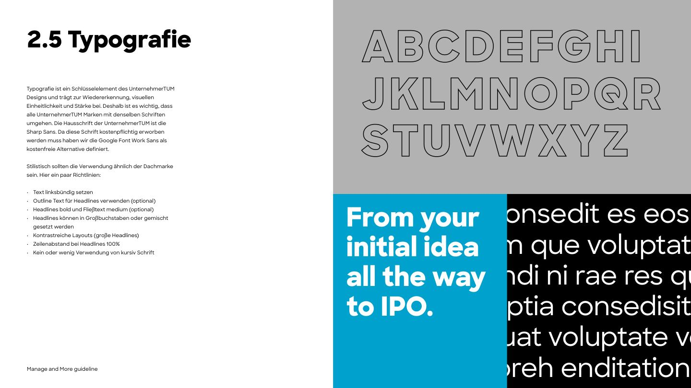

# Typography



## Typefaces

| Typeface | Role | Weights | Where | Licence / files |
|---|---|---|---|---|
| **Sharp Sans** | House typeface of UnternehmerTUM and its brands. **Default for Manage and More web and designed media.** | **Medium 500** (body), **Extrabold 800** (headlines). The website loads only these two. | manageandmore.de, any web project with the files, print, social | Commercial ([sharptype.co](https://sharptype.co)). **Manage and More holds a licence** (confirmed 2026-10-07). The WOFF2 files live in the website repo (`manage-and-more-website/src/fonts/SharpSans-Medium.woff2`, `SharpSans-Extrabold.woff2`). **Not in this repo**, which may be shared outside the team. |
| **Work Sans** | Free fallback for Sharp Sans, and the face for anyone without the files (agencies, public templates). Also Google Docs and Sheets. | Regular, Medium, Bold, ExtraBold, italics | Fallback in every web stack; open projects | SIL OFL, bundled in [`assets/fonts/work-sans/`](../assets/fonts/work-sans/) |
| **Arial** | Office fallback | Regular, Bold, italics | E-mail signatures, PowerPoint, Google Slides, external correspondence | System font |

The guideline PDF itself is set in Sharp Sans Medium and Extrabold. Sharp Sans has a geometric, wide character; Work Sans is the closest free match.

### Choosing

1. **Web projects of the Manage and More team:** Sharp Sans 500/800, copied from the website repo, with the Work Sans fallback loaded too (token `--mm-font-family-web`).
2. **Projects without the Sharp Sans files** (external partners, public templates, quick prototypes): Work Sans (`--mm-font-family-open`).
3. Print and social design: Sharp Sans.
4. Google Docs/Sheets: Work Sans. Google Slides and PowerPoint: Arial (PDF p.20-21).
5. E-mail: Arial.

### Loading Sharp Sans

```css
@font-face { font-family: "Sharp Sans"; src: url("/fonts/SharpSans-Medium.woff2") format("woff2"); font-weight: 500; font-style: normal; font-display: swap; }
@font-face { font-family: "Sharp Sans"; src: url("/fonts/SharpSans-Extrabold.woff2") format("woff2"); font-weight: 800; font-style: normal; font-display: swap; }
@import "assets/fonts/work-sans/work-sans.css"; /* fallback */
body { font-family: var(--mm-font-family-web); } /* "Sharp Sans", "Work Sans", Arial, sans-serif */
```

In Next.js the website uses `next/font/local` with both files and `variable: "--font-sharp-sans"` (`src/lib/fonts.ts`).

- Use only weights 500 and 800 with Sharp Sans. Other weights (400, 700) would be synthesised by the browser. `--mm-font-weight-regular` and `-bold` are for Work Sans only.
- Never commit the Sharp Sans files to a public repository. In a new project, put them in their own folder (e.g. `fonts/sharp-sans/`) and add that folder to `.gitignore` unless the repository is private to the Manage and More team.

### Which Work Sans files to copy

For the web fallback copy [`work-sans.css`](../assets/fonts/work-sans/work-sans.css) and the two upright variable files it references: `web/work-sans-latin-wght-normal.woff2` and `web/work-sans-latin-ext-wght-normal.woff2`. The brand uses no italic, so the italic files are optional; the browser only requests them if italic text appears. The static `400/500/700/800` files and `desktop/` TTFs are for tools that cannot use variable fonts.

## Style rules (PDF p.18, as applied on the website)

1. **Left-aligned text.** No centred or justified body copy. (The application countdown is the one centred block on the website.)
2. **Headlines Extrabold 800, body Medium 500.**
3. **Headlines in capitals or mixed case**, both allowed. The website uses Title Case and sentence case; the home hero's outline line is in capitals.
4. **Outline text for headlines**: on the website this is the signature [two-tone heading](#two-tone-heading).
5. **High-contrast layouts with big headlines.** Section headings are 2.5× the body size on desktop (50px vs 20px).
6. **Headline line spacing:** **1.15 on screens** (decision 2026-10-07: it leaves room for the outline stroke and stacked lines); **100% (1.0) in print, slides and designed media** (PDF p.18).
7. **No italic.** The website uses none. Emphasis in headings comes from the outline/solid contrast; emphasis in body copy from **Extrabold** phrases (`<strong>`).
8. Headings use `text-wrap: balance`. No letter-spacing on headlines.

## Screen type scale *(adopted from manageandmore.de, stored in rem)*

`mobile` applies from 0; the other steps from the breakpoint shown. Sizes in px at a 16px root.

| Role | Token | Mobile | ≥768 | ≥992 | ≥1200 | ≥1536 | Weight | Line height |
|---|---|---|---|---|---|---|---|---|
| Display (hero h1) | `--mm-font-size-display-*` | 30 | 50 | 40 | 50 | 75 | 800 | 1.15 |
| Heading (section h2) | `--mm-font-size-heading-*` | 25 | 50 | 50 | 50 | 50 | 800 | 1.15 |
| Lead (intro statement) | `--mm-font-size-lead-*` | 20 | 30 | | | | 500 (key phrase 800) | 1.5 |
| Subheading (h3) | `--mm-font-size-subheading` | 24 | | | | | 800 | 1.15 |
| Title (card, list item) | `--mm-font-size-title` | 20 | | | | | 800 | 1.15-1.25 |
| Body | `--mm-font-size-body-*` | 15 | 17 | 17 | 20 | 20 | 500 | 1.5 |
| Small (footer, chips, roles) | `--mm-font-size-small` | 14 | | | | | 500 / 800 | 1.5 |
| Caption | `--mm-font-size-caption` | 12 | | | | | 500 | 1.0-1.4 |
| Stat value | `--mm-font-size-stat-*` | 30 | 40 from 640 | | 50 from 1280 | | 800 | 1.0 |
| Stat label | `--mm-font-size-stat-label-*` | 12 | 15 from 1024 | | | | 500 | 1.0 |
| Nav (desktop) | `--mm-font-size-nav` | 15.2 | | | | | 500 | |
| Nav (mobile menu) | `--mm-font-size-nav-mobile` | 30 | | | | | 800 | |

Notes:

- The display size dips from 50px to 40px between 992 and 1199px; this mirrors the website exactly.
- Body text is set once on `<body>`. Paragraphs inherit it, so a "large text" utility is not needed. The website deliberately neutralises Tailwind's `text-lg`.
- Uppercase small labels get letter-spacing: 0.025em (footer column headings), 0.08em (roles under names), 0.16em (eyebrow counts).
- The website writes most sizes in px; this repo stores them in rem so that they scale with the user's browser font size.

## Two-tone heading

The signature heading of the website: an **outlined** line above a **solid** line. Spec: [13-web-components.md](13-web-components.md#section-heading-two-tone).

```css
.mm-outline {
  -webkit-text-fill-color: transparent;
  -webkit-text-stroke: var(--mm-stroke-outline-text-mobile) currentColor;   /* 1px */
}
@media (min-width: 576px) { .mm-outline { -webkit-text-stroke-width: var(--mm-stroke-outline-text-desktop); } } /* 1.5px */
```

The stroke uses `currentColor`, so the heading adapts to every section tone. Use it for headings of 25px and up only.

## Example

```css
@import "tokens/build/tokens.css";
body { font-family: var(--mm-font-family-web); font-weight: 500; font-size: var(--mm-font-size-body-mobile); line-height: 1.5; color: var(--mm-color-semantic-text); text-align: left; }
@media (min-width: 768px)  { body { font-size: var(--mm-font-size-body-tablet); } }
@media (min-width: 1200px) { body { font-size: var(--mm-font-size-body-desktop); } }
h1, h2, h3 { font-weight: 800; line-height: var(--mm-font-line-height-headline); text-wrap: balance; }
```

A full implementation with all breakpoints is in [`examples/mm-base.css`](../examples/mm-base.css).

## Font files in this repo

- `assets/fonts/work-sans/web/`: WOFF2. Variable (weights 100-900, latin and latin-ext, normal and italic) and static latin 400/500/700/800.
- `assets/fonts/work-sans/desktop/`: variable TTF for installing on a computer (Word, Keynote, Figma).
- `assets/fonts/work-sans/OFL.txt`: licence.
- Sharp Sans: not here. Ask the Manage and More team or copy it from the website repo.
