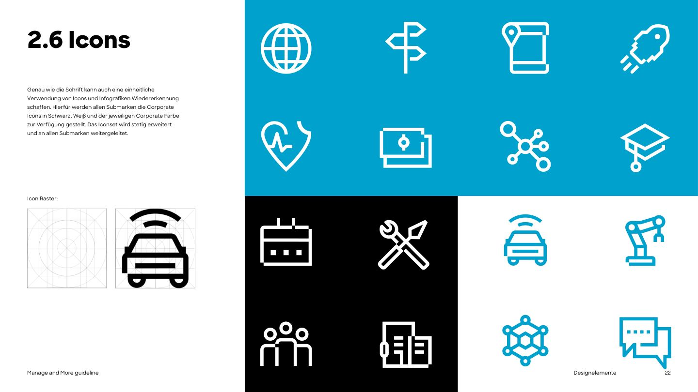

# Iconography



Like typography, consistent icons and infographics build recognition. All sub-brands receive the corporate icons in **black, white and their corporate colour** (Manage and More: blue). The set is extended over time.

## Style

- **Monoline outline icons**: one even stroke weight, square/flat stroke ends, mostly right angles and full circles, built on a square icon grid (PDF p.22 shows the grid).
- No fills except small solid details (dots, the centre of a coin).
- One colour per icon: black, white or blue. Never multicolour, never gradients.
- Icons sit on white, black or blue surfaces; blue icons on white, white icons on blue or black, black icons on white or yellow.

## Files

16 icons, extracted as vectors from PDF p.22. The SVGs use `currentColor`, so they inherit the text colour in HTML. PNGs are 256px in blue and black.

| Name | SVG | | Name | SVG |
|---|---|---|---|---|
| globe | [svg](../assets/icons/svg/globe.svg) | | calendar | [svg](../assets/icons/svg/calendar.svg) |
| signpost | [svg](../assets/icons/svg/signpost.svg) | | tools | [svg](../assets/icons/svg/tools.svg) |
| map | [svg](../assets/icons/svg/map.svg) | | connected-car | [svg](../assets/icons/svg/connected-car.svg) |
| rocket | [svg](../assets/icons/svg/rocket.svg) | | robot-arm | [svg](../assets/icons/svg/robot-arm.svg) |
| health | [svg](../assets/icons/svg/health.svg) | | team | [svg](../assets/icons/svg/team.svg) |
| money | [svg](../assets/icons/svg/money.svg) | | building | [svg](../assets/icons/svg/building.svg) |
| network | [svg](../assets/icons/svg/network.svg) | | technology | [svg](../assets/icons/svg/technology.svg) |
| education | [svg](../assets/icons/svg/education.svg) | | chat | [svg](../assets/icons/svg/chat.svg) |

The names are descriptive names given in this repo; the PDF does not name the icons.

## When an icon is missing *(derived)*

The corporate set is small. When you need another icon, use an open-source monoline set that matches the style (square caps, geometric, even stroke), and keep the stroke weight visually equal to the brand icons. **[Tabler Icons](https://tabler.io/icons)** or **Lucide** with `stroke-width` ≈ 2 at 24px, `stroke-linecap="square"`, `stroke-linejoin="miter"` come closest. Don't mix filled and outline styles. Add new brand-approved icons to `assets/icons/svg/` and to `assets/catalog.json`.

```html
<span style="color: var(--mm-color-brand-blue)">
  <!-- inline the SVG so currentColor applies -->
</span>
```

## UI glyphs *(adopted from the live website)*

Small functional marks for controls are a separate set from the brand pictograms above. They come from the live site's icon set (`utum-icon`, shared across UnternehmerTUM sites) and live in [`assets/ui/svg/`](../assets/ui/svg/) (catalogue kind `ui-glyph`):

| Glyph | File | Used in |
|---|---|---|
| Arrows | [right](../assets/ui/svg/arrow-right.svg), [left](../assets/ui/svg/arrow-left.svg), [up](../assets/ui/svg/arrow-up.svg), [down](../assets/ui/svg/arrow-down.svg) | arrow-link sticker, carousel controls, "Back to top" |
| Chevron down | [chevron-down](../assets/ui/svg/chevron-down.svg) | dropdowns |
| Check | [check](../assets/ui/svg/check.svg) | requirement and highlight lists |
| Plus / minus | [plus](../assets/ui/svg/plus.svg), [minus](../assets/ui/svg/minus.svg) | FAQ sticker (closed / open) |
| Close, menu | [close](../assets/ui/svg/close.svg), [hamburger](../assets/ui/svg/hamburger.svg) | mobile menu, overlays |
| Quote | [quote](../assets/ui/svg/quote.svg) | under testimonial quotes, ~75px wide |
| LinkedIn | [linkedin](../assets/ui/svg/linkedin.svg) | person and alumni cards (third-party mark) |

- 40×40 grid, drawn as **filled paths with a 2-unit line and square ends**, `fill="currentColor"`. Thin and long, like the brand icons. Not stroked, no round caps.
- In the **sticker** (filled circle) the glyph is 1.333em and takes the section's background colour; see [13-web-components.md](13-web-components.md#arrow-link-primary-call-to-action).
- **Inline the SVG** (paste the markup) whenever the glyph must follow `currentColor` or the background colour; an `` cannot change colour, and CSS masks fail on pages opened from disk.
- Decorative glyphs get `aria-hidden`; the control carries the `aria-label`.
- The live icon set has about 60 more pictograms (e.g. smart-industry, drone, mobility, workshop). They are not in this repo yet.
