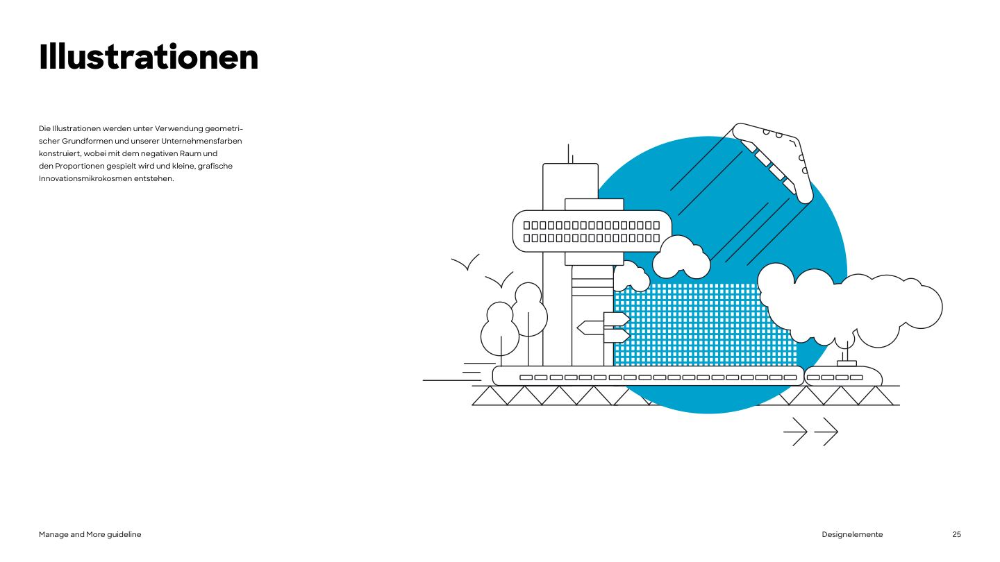

# Illustration

The illustration style comes from the simple shapes of the logo. **Simple shapes, clear lines, limited colours and a heightened reality** give the illustrations a brand-specific feel and make them easy to understand at a glance (PDF p.23).

Illustrations are built from **geometric basic shapes and the corporate colours**, playing with **negative space and proportion**, creating small graphic "micro-cosmos of innovation" (PDF p.25).

## Recipe

1. **Line art** in black (on white/yellow/blue) or white (on black), one consistent thin stroke weight, round or flat ends.
2. **One large flat shape in a brand colour** behind the scene, typically a big **blue circle** or a full **yellow** background.
3. **Texture through patterns**: dot grids, hatching and fine line fields (e.g. the building façade grid, the dotted ground), never gradients.
4. **White fills** to knock objects out of the colour shape (clouds, gears, the UFO).
5. Motifs of innovation and Munich: rockets, drones, gears, light bulbs, wind turbines, the Olympic tower, labs, trains, UFOs.
6. Slight "heightened reality": a playful, slightly surreal composition (a rocket over a city, a UFO with rings).

## Files (vector, cropped from the PDF)

| File | Scene |
|---|---|
| [`illustration-city-port.svg`](../assets/illustrations/svg/illustration-city-port.svg) | City/port with tower, train, clouds, blue circle |
| [`illustration-idea-head-on-yellow.svg`](../assets/illustrations/svg/illustration-idea-head-on-yellow.svg) | Head in profile with gears, bulb, rocket on yellow |
| [`illustration-wind-tower.svg`](../assets/illustrations/svg/illustration-wind-tower.svg) | Wind turbine, Olympic tower, drone, blue circle |
| [`illustration-ufo-on-black.svg`](../assets/illustrations/svg/illustration-ufo-on-black.svg) | White UFO with dashed orbit rings on black |

PNG previews are in `assets/illustrations/png/`. The SVGs are page crops: they render correctly, but contain off-canvas leftovers from the PDF page. Use them as is, or as style references for new illustrations.

## Do not

- No 3D renders, gradients, drop shadows or photo-realistic illustration.
- No colours outside the palette.
- No stock "corporate Memphis" figures with purple skin tones.
