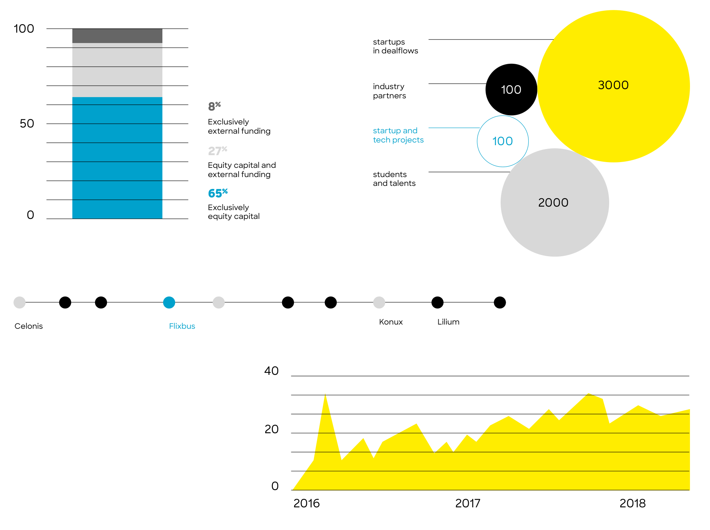

# Infographics and data visualisation

All infographics are based on **simple elements**: **high-contrast lines combined with large flat shapes** (PDF p.24).

## Rules *(from the PDF examples)*

- **Colours:** blue for the primary series, yellow for the highlight series or area, black for strong accents and outlines, grey `#E3E3E3` and 40%/60% black for secondary data and gridlines.
- **Lines:** thin black axes and gridlines; timelines are a thin line with solid dots (black, blue for the highlighted item, grey for others).
- **Shapes:** stacked bars as plain rectangles; bubble charts with large flat circles (yellow, black, grey, or blue outline); area charts as flat yellow fills.
- **Numbers big and bold** (Extrabold), labels small in Medium, left-aligned, lowercase or sentence case.
- No 3D, no shadows, no gradients, no rounded bar caps, no pie-chart explosions.

## Example series order for charts *(derived)*

1. `#00A2CD` blue  2. `#000000` black  3. `#FFED00` yellow (fills/areas, never thin lines on white)  4. `#878787` 60% black  5. `#B2B2B2` 40% black

Gridlines `#E3E3E3`, axis text 80% black `#575756`.
