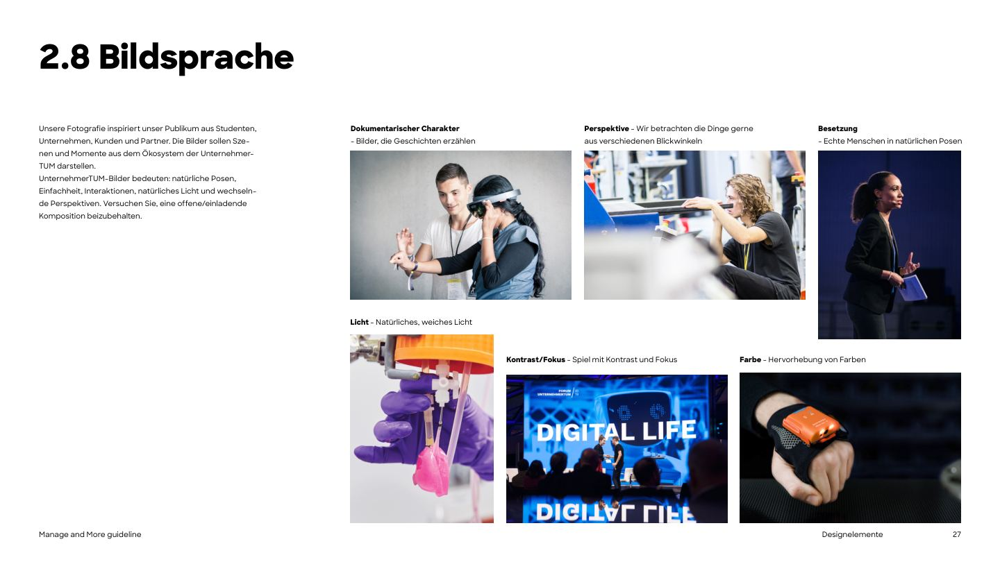

# Photography



Photography should inspire our audience of **students, companies, customers and partners**. Images show **scenes and moments from the UnternehmerTUM / Manage and More ecosystem**: **natural poses, simplicity, interactions, natural light and changing perspectives**, with an **open, inviting composition** (PDF p.27).

## Six principles (PDF p.27)

| Principle | Meaning |
|---|---|
| **Documentary character** | Images that tell stories. |
| **Perspective** | Look at things from different angles (from above, close-ups, through objects). |
| **Casting** | Real people in natural poses, no models, no staged stock smiles. |
| **Light** | Natural, soft light. |
| **Contrast / focus** | Play with contrast and shallow depth of field. |
| **Colour** | Emphasise strong colours where they occur naturally. |

## By subject

- **People** (p.28): show real people, captured in interactions. Portraits look natural and unposed.
- **Events** (p.29): capture moments and interactions. Avoid busy backgrounds that distract from the subject; a calm composition is essential.
- **Startups** (p.30): besides the products, document how they are made. Founder portraits are always welcome.
- **Tech** (p.31): digital applications, tools and screens. Close-ups help keep a clear focus.

## Treatments (p.32)

Besides colour photos you may use **black-and-white** and **brand-blue-tinted** photos. Use calm images with few details, don't overuse the effects, and treat them as **highlight elements**.

Recreate the treatment with [`scripts/tint_photo.py`](../scripts/tint_photo.py) (`--mode blue` or `--mode bw`), or in CSS:

```css
.mm-photo-tint { position: relative; }
.mm-photo-tint img { filter: grayscale(1) contrast(1.1); mix-blend-mode: multiply; }
.mm-photo-tint { background: var(--mm-color-brand-blue); }
```

## On the website *(adopted)*

- **Hero:** full-bleed photo (source files 1920×960, 2:1) or a muted background video, under a **flat black shade** of 20-60% (`--mm-opacity-shade-*`) so the white headline stays legible. This is the exception to "no text over photos": allowed only with the shade, and only when the contrast checks in [13-web-components.md](13-web-components.md#hero) pass.
- **In grids:** cropped with `object-fit: cover` to fixed ratios: 4:3 photo cards, 4:5 team portraits (focus at 38% from the top), 1:1 scholar and testimonial portraits, 16:9 video. Rounded with `--mm-radius-card` (grids) or `--mm-radius-feature` (large media).
- **Content:** Manage and More's own photos: whole generations in M&M hoodies, workshops, talks, Startup Tour dinners, coaching, graduation. They match the PDF principles (documentary, real people, interaction, natural light).
- B/W and blue tint are not used on the website today.
- Exception: the Startups hero is a night-sky image, not a documentary photo; for new heroes prefer real people.

## Reference images

`assets/photography/<topic>/` contains the example photos from the PDF, downscaled to 1600px: `cover`, `principles`, `people`, `events`, `startups`, `tech`, `toning` (originals plus `*-blue-tint.jpg` examples), `merchandise`.

[`assets/photography/website/`](../assets/photography/website/) holds a curated set of **Manage and More's own photos** from manageandmore.de (WebP): cohort group, bootcamp workshop, graduation, event talk, scholars group, Startup Tour dinner, coaching, alumni group. They are the best references for the real M&M look.

> **Usage rights:** the PDF photos are UnternehmerTUM example photos taken from the guideline. Use them as **style references and internal mock-ups**. Check rights with the Manage and More / UnternehmerTUM marketing team before publishing them. For real projects use Manage and More's own event and community photos. The website photos are Manage and More's own, but they show real people: confirm consent before using them outside the website.

## Do not

- Staged stock photos, fake laughter, models in suits shaking hands.
- Heavy filters, vignettes, colour grading outside B/W and blue tint.
- Busy images with lots of background clutter.
- Text placed over the busy part of a photo (use a solid colour block next to it instead).
