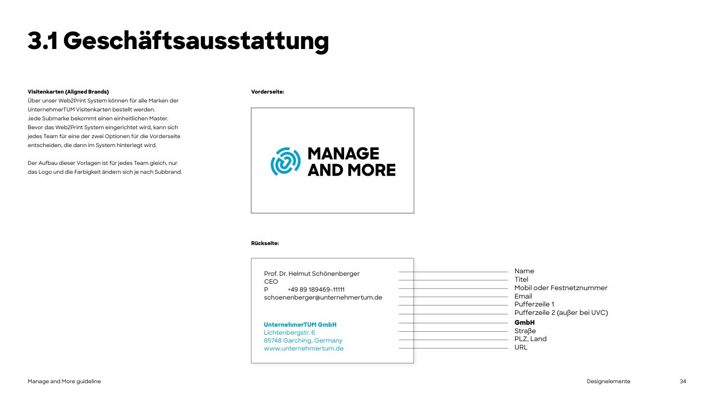
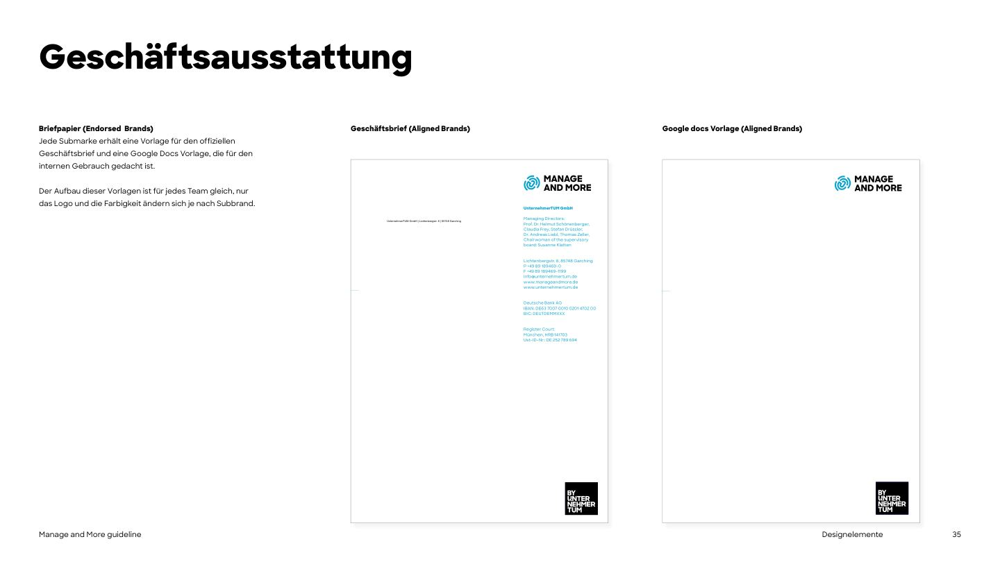
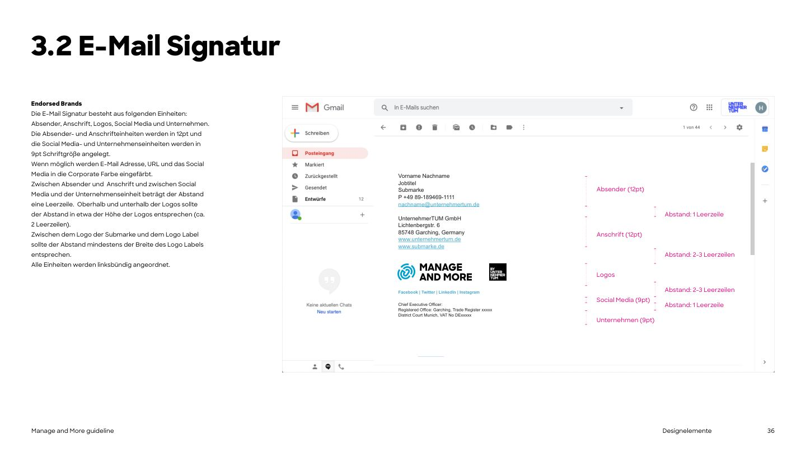
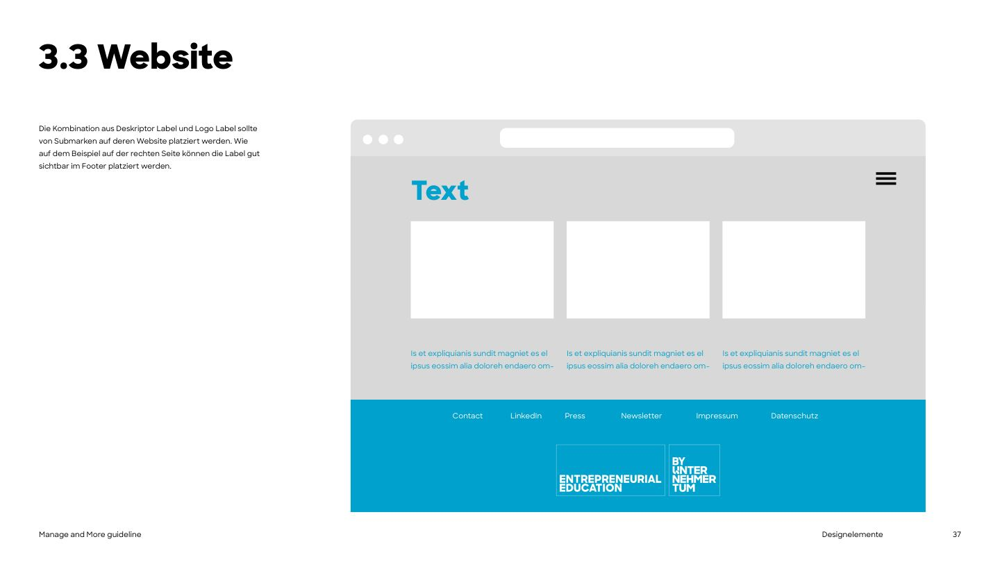
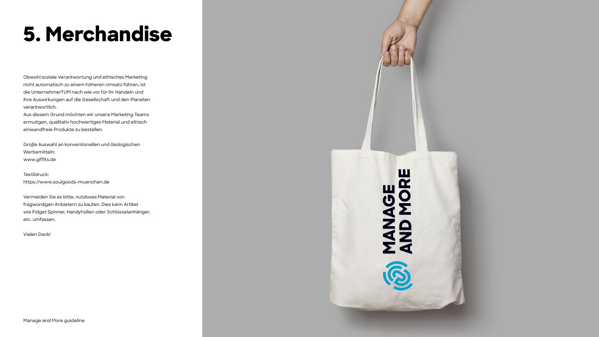

# Applications

## Business cards (PDF p.34)



- Ordered via the UnternehmerTUM **Web2Print** system. Each sub-brand has one master; teams choose one of two front options once.
- **Front:** the Manage and More logo, centred on white with a thin frame (as shown).
- **Back, line by line:** Name / Title / Phone (mobile or landline, prefixed "P") / E-mail / buffer line 1 / buffer line 2 / **company in blue Extrabold** ("UnternehmerTUM GmbH") / street / postcode, city, country / URL. Company block in M&M blue.
- **No logo label on business cards.**

## Letterhead and Google Docs template (PDF p.35)



- Each sub-brand gets an official letter template and a Google Docs template for internal use. Same layout for every team; only logo and colour change.
- Logo top right; sender details in a right-hand column in blue (Managing Directors, address, phone, e-mail, `www.manageandmore.de`, `www.unternehmertum.de`, bank details, register court); BY UNTERNEHMERTUM label bottom right.
- Templates live on the UnternehmerTUM intranet (see links below).

## E-mail signature (PDF p.36)



Font: **Arial**. All units **left-aligned**. Units, top to bottom:

| Unit | Size | Content |
|---|---|---|
| Sender | 12pt | First Last / Job title / Sub-brand / P +49 89 189469-xxxx / e-mail |
| *1 empty line* | | |
| Address | 12pt | UnternehmerTUM GmbH / Lichtenbergstr. 6 / 85748 Garching, Germany / www.unternehmertum.de / www.manageandmore.de |
| *2-3 empty lines* (about the logo height) | | |
| Logos | | Manage and More logo + logo label; gap between them at least the label's width |
| *2-3 empty lines* | | |
| Social media | 9pt | Facebook \| Twitter \| LinkedIn \| Instagram |
| *1 empty line* | | |
| Company | 9pt | Managing directors, registered office, trade register, VAT number |

E-mail address, URLs and social links in **brand blue** where possible.

Template (fill in the placeholders; copy as HTML):

```html
<table cellpadding="0" cellspacing="0" style="font-family: Arial, sans-serif; color:#000; text-align:left;">
  <tr><td style="font-size:12pt; line-height:1.3;">
    First Last<br>Job title<br>Manage and More<br>P +49 89 189469-xxxx<br>
    <a href="mailto:first.last@unternehmertum.de" style="color:#00A2CD; text-decoration:none;">first.last@unternehmertum.de</a><br><br>
    UnternehmerTUM GmbH<br>Lichtenbergstr. 6<br>85748 Garching, Germany<br>
    <a href="https://www.unternehmertum.de" style="color:#00A2CD; text-decoration:none;">www.unternehmertum.de</a><br>
    <a href="https://www.manageandmore.de" style="color:#00A2CD; text-decoration:none;">www.manageandmore.de</a><br><br>
  </td></tr>
  <tr><td style="padding:12pt 0;">
    
    
  </td></tr>
  <tr><td style="font-size:9pt; line-height:1.3;">
    <a href="https://www.linkedin.com/school/manage&more-by-unternehmertum/" style="color:#00A2CD;">LinkedIn</a> |
    <a href="https://www.instagram.com/manageandmore/" style="color:#00A2CD;">Instagram</a><br><br>
    Managing Directors: …<br>Registered Office: Garching, Trade Register …<br>District Court Munich, VAT No …
  </td></tr>
</table>
```

## Website (PDF p.37)



- Place the **descriptor label + logo label** clearly visible in the **footer**.
- Example layout: grey content area, blue Extrabold headline, three image tiles with blue captions, **blue footer** with links (Contact, LinkedIn, Press, Newsletter, Impressum, Datenschutz) and the white-outline label lock-up centred below.
- See [10-layout.md](10-layout.md) for screen components and [sources-and-discrepancies.md](sources-and-discrepancies.md) for how the live site differs.

### The live website *(manageandmore.de, adopted as the screen standard 2026-10-07)*

- **Stack:** Next.js 16, Tailwind CSS v4 with a single theme file (`src/styles/theme.css`), self-hosted Sharp Sans. Repo: `manage-and-more-website`.
- **Pages:** Home, Program, Application, People, Startups, Alumni, Imprint, Privacy Policy. English only.
- **Structure:** fixed transparent header → full-bleed hero (photo or video, black shade, two-tone h1, BY UNTERNEHMERTUM label in the corner) → alternating black and white sections, with blue for emphasis → black footer.
- **Footer:** black rather than the PDF's blue, with address, social and legal links. The descriptor + label lock-up still has to be added.
- Every component is specified in [13-web-components.md](13-web-components.md). To build a new M&M page, start from [`examples/landing-page.html`](../examples/landing-page.html), or use `tokens/build/tailwind.theme.css` in a Tailwind v4 project.

## Presentations *(PDF p.20-21 + page anatomy of the PDF)*

- PowerPoint and Google Slides: **Arial** (Work Sans is fine in Keynote/Figma/web-based decks).
- 16:9; logo label 24.1mm (≈ 1/8 of the slide height) in a corner.
- Title slides: full blue or full black, white logo, huge Extrabold title (black on blue, white on black; white on blue fails contrast, see [04-color.md](04-color.md)). Headline leading 100%. Content slides: white, title top left, text left third, visuals right.
- Official UnternehmerTUM PPT/Slides templates and screensavers: see links below.

## Merchandise (PDF p.39-40)



- Example: natural cotton tote with the logo **set vertically** (rotated 90°, symbol at the bottom) in blue symbol + black wordmark.
- Order **high-quality, ethically sound products**. Suppliers named in the PDF: [giffits.de](https://www.giffits.de) (conventional and eco promo items) and [soulgoods-muenchen.de](https://www.soulgoods-muenchen.de) (textile printing).
- Avoid useless items from questionable suppliers (fidget spinners, phone cases, key rings and the like).

## Useful links (PDF p.38, UnternehmerTUM intranet, login required)

- Guideline A: Brand Elements and Mini Logo Guideline: `sites.google.com/unternehmertum.de/home/grundlagen/marketing-digital-products/ci-styleguides`
- Business cards: `utum.onelogin.com/portal/`
- Letterhead UnternehmerTUM / Projekt GmbH / sub-brands: `sites.google.com/unternehmertum.de/home/grundlagen/marketing-digital-products/briefvorlagen`
- PPT / Google Slides and screensaver: `sites.google.com/unternehmertum.de/home/grundlagen/standardpräsentationen-teambeschreibungen`
- Questions: MDPM team (UnternehmerTUM Marketing & Digital Products).
